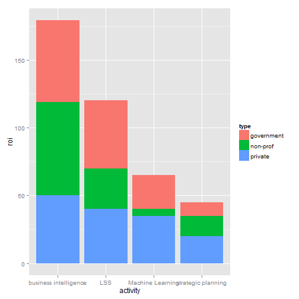

## How It Works

Start by simply clicking the link below.  

http://benuminsky.shinyapps.io/dataprod/
  
Then choose either the Widget or Gidget bureaus to view data on their specific operations. The primary Gidget operation is "swivel production", which entails employees on an assemply line assembling two smaller pieces to form a swivel.  The core focus of the "sprocket" operation is to fit swivels into pre fabricated sprockets. Those sprockets will then be asssembled in another operation with other parts into the final Gidget product. 

A maanager may select a date range to explore general data patterns using the widget found on the left sidebar panel. You can also enter the number of expected swivels that need to be produced in the "predict staff" widget to estimate the number of staff needed to complete that many swivelswd(. 

---

## Return on Investment

Invest in the right things at the right time. The chart below shows the percentage gained in dollars for the type of business activity investment. The app you saw before represents business intelligence.

 

---
  
## Hard Choices

__What can you do with this real time business intelligence to enhance your operations?__

1. Chuck it out because you don't believe in data analytics

2. Check the app every now and then and see if it jives with your gut instinct as a manager

3. Have your admin assistant review it and tell you what they see.

4. Regularly use the app to make better business decisions.

